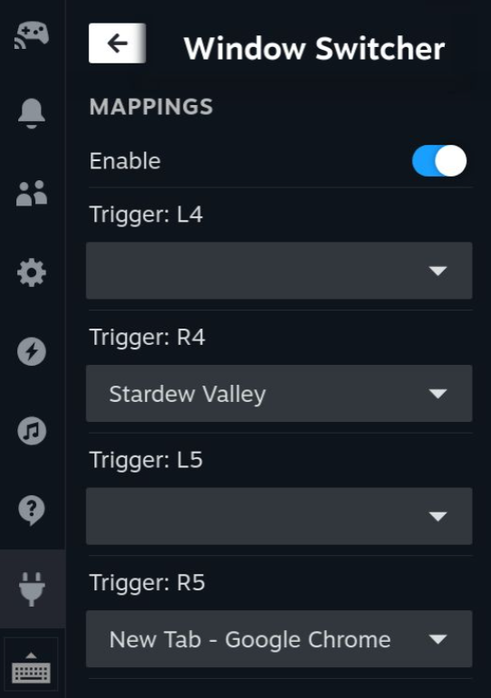

# decky window switcher

A [Decky Loader](https://github.com/SteamDeckHomebrew/decky-loader) plugin that
allows you to quickly switch between windows using the buttons on your Steam
Deck.

## limitations

Currently only L4, R4, L5, and R5 can be bound. Mappings are not persistent across
restarts.